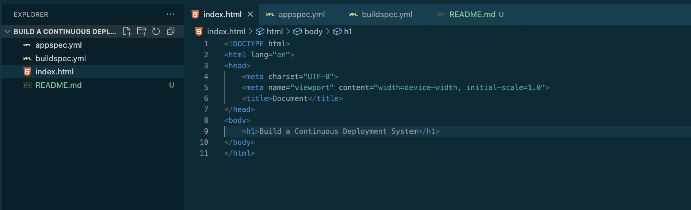
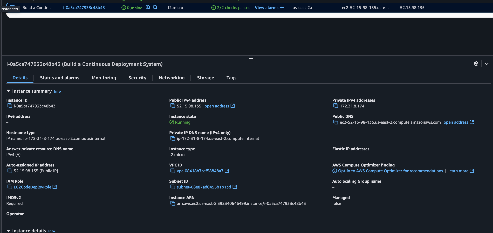
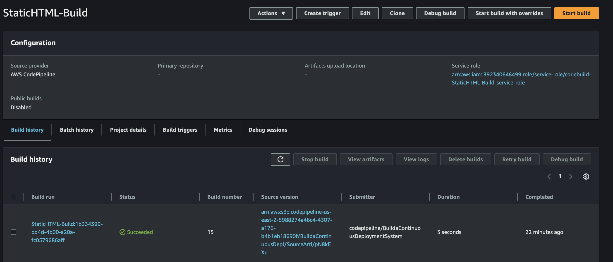
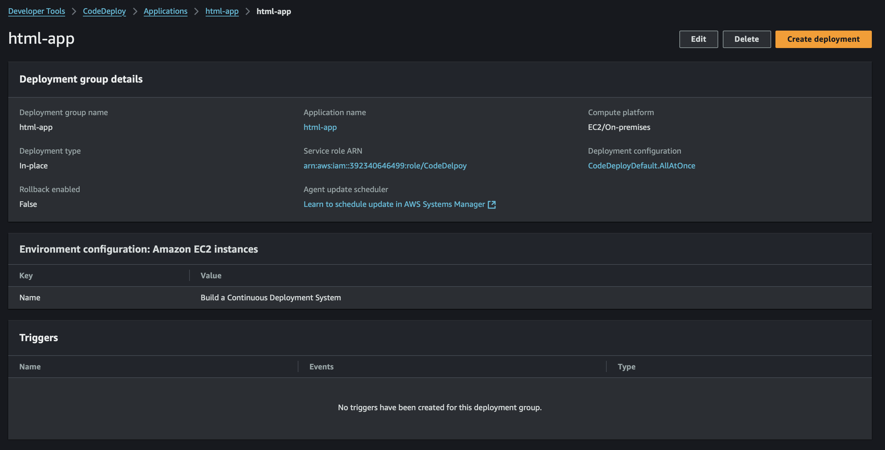
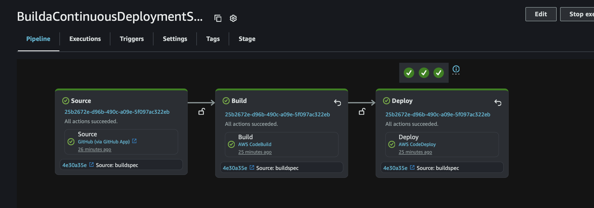

# Build a Continuous Deployment System

## Create the Repository
First, I created the repository with the same name as the project. It only included three files:
- index.html
- appspec.yml
- buildspec.yml

## Set Up the EC2 Server
I launched an EC2 instance with open ports to serve the index.html file. Then, I installed NGINX directly from the console to display the index.html on the server.

## Start Building the Pipeline
I began configuring the deployment pipeline.

## Source Stage (GitHub Integration)
In the Source stage, I used the GitHub application to connect my repository to the pipeline.

## Build Stage (Permissions Challenges)
The Build Stage was the most challenging part—I struggled with permission settings. After troubleshooting errors one by one, I finally configured the project (named StaticHTML) with the necessary permissions.

## Deploy Stage (Final Adjustments)
The Deploy Stage also took several hours due to issues with the buildspec.yml and permissions. Eventually, I simplified the process by using a CodeDeploy application named html-app.

## Success!
After all the adjustments, I successfully deployed the app to NGINX using the pipeline.
